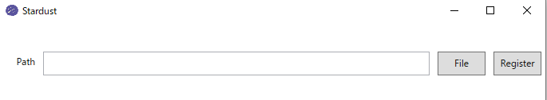

# Stardust

    

Stardust manages applications added to Start Menu of Windows10.

## How to install

Theare is two pattern.

- Download [here](https://github.com/yasukotelin/Stardust/releases) and unzip folder.
- Buid this project.

## How to register your application to the start menu.

1. Start the Stardust app.
2. Input the application path yourself or click `File` to select your application.
3. When click the `Register` button, your selecting application is registered with the start menu. 

> **NOTE** Your application that is registered by the Stardust app is placed below the Stardust folder.